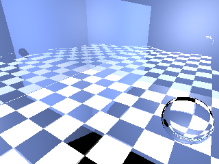
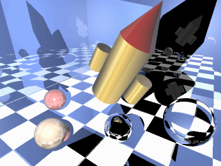
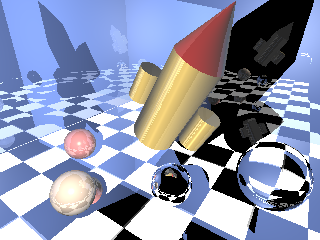
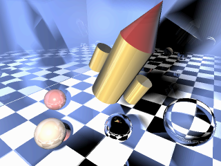

# raytracing
Implementation of  a ray tracer with shadows with mirror reflection and some advanced rendering effects.

Working with teammate Vivian Ma.(Credit to Vivian)  
(Starter code from HKU course Computer Graphics.)  

###Advanced rendering effects:

1. Flattening scene graph  

	Cache the transformation matrices when doing the traversail to avoid recomputing each time.

2. Refraction: Snell's law.

	
3. Anti-aliasing: Multiple rays for each pixel and combine them to get the resulting color.  
	
4. Texture mapping
6. Area light sources
7. Glossy reflections   
	
	The generated image with primitives added.   
	
	  
	The generated image with soft shadow added.This is also the final image   
	
	